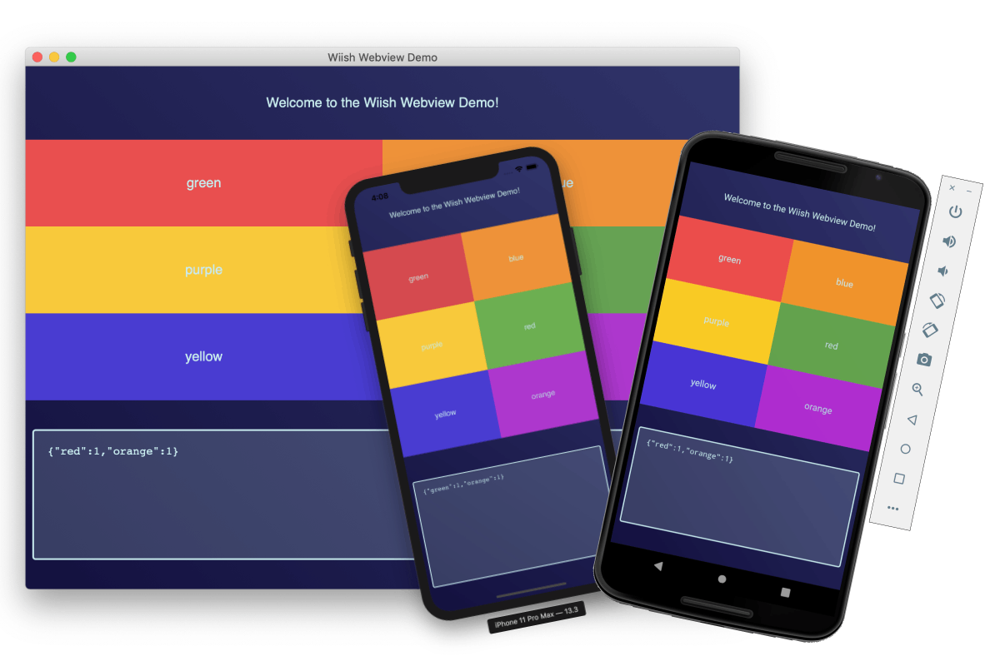

[](https://github.com/iffy/wiish/actions?query=branch%3Amaster)

<div style="text-align:center;"></div>

[Docs](https://www.iffycan.com/wiish/) | [Changelog](./CHANGELOG.md)

Wiish (Why Is It So Hard) GUI framework might one day make it easy to develop, package and deploy auto-updating, cross-platform applications for desktop and mobile.  If it succeeds, maybe the name will have to change :)

**Wiish is currently ALPHA quality software.**  Don't make anything with it unless you're willing to rewrite it when this package changes.




# Quickstart

1. Install [Nim](https://nim-lang.org/install.html) and `nimble`

2. Install Wiish:

    ```bash
    nimble install https://github.com/iffy/wiish.git
    ```

3. Find out what other dependencies you need:

    ```bash
    wiish doctor
    ```

4. Create a project and run it:

    ```bash
    wiish init somedir
    cd somedir
    wiish run
    ```

See `wiish --help` for more, but here are other examples.  Some only work within a Wiish project:

```
wiish run --os ios-simulator
wiish run --os android
wiish build
wiish init --base-template opengl my_opengl_app
```

# Features

Wiish provides:

1. A `wiish` command line tool for running, building and packaging apps.
2. A `wiish` Nim library (i.e. `import wiish/...`) for app-specific helpers (e.g. auto-updating, asset-access, etc...)
3. Plugins for different GUI frameworks: `import wiish/plugins/...`

# Plugins

Wiish uses a plugin system to support various GUI frameworks:

- `wiish/plugins/webview` - For webview apps based on [oskca/webview](https://github.com/oskca/webview).
- `wiish/plugins/sdl2` - **TEMPORARILY UNMAINTAINED** For SDL and OpenGL apps based on [nim-lang/sdl2](https://github.com/nim-lang/sdl2).

The GUI component is designed to work separately from other features (e.g. auto-updating, packaging, etc...) so that different GUI libraries can be swapped in/out.

It is hoped that more plugins will be introduced for other GUI frameworks.

## Support Matrix

The following shows the support matrix of **automated** tests.  Actual support may be better or worse than described here.

- `Yes` - For `wiish run`, this means that the application starts and continues running for a few seconds.  For `wiish build` it means the build succeeded.
- `No` - Means it failed
- `-` - Means it's not supported (and isn't planned to be supported)
- `Planned` - Means it doesn't currently work, but we're planning on getting it to work.
- `Untested` - Means that it *might* work when run on a real computer, but our automated tests aren't yet capable of testing it.  For instance, we haven't yet figured out how to run GUI applications on Windows so those are mostly marked `Untested`.

| Host OS | `--os`        | Example      | `wiish run` | `wiish build` |
| ------- | ------------- | ------------ | :---------: | :-----------: |
| windows | android       | opengl       |   Planned   |    Planned    |
| windows | android       | sdl2         |   Planned   |    Planned    |
| windows | android       | webview      |   Planned   |    Planned    |
| windows | mobiledev     | opengl       |  Untested   |       -       |
| windows | mobiledev     | sdl2         |  Untested   |       -       |
| windows | mobiledev     | webview      |  Untested   |       -       |
| windows | windows       | opengl       |  Untested   |    Planned    |
| windows | windows       | plainwebview |  Untested   |    Planned    |
| windows | windows       | sdl2         |  Untested   |    Planned    |
| windows | windows       | webview      |  Untested   |    Planned    |
| linux   | android       | opengl       |   Planned   |      Yes      |
| linux   | android       | sdl2         |   Planned   |      Yes      |
| linux   | android       | webview      |   Planned   |      Yes      |
| linux   | mobiledev     | opengl       |     Yes     |       -       |
| linux   | mobiledev     | sdl2         |     Yes     |       -       |
| linux   | mobiledev     | webview      |     Yes     |       -       |
| linux   | linux         | opengl       |     Yes     |    Planned    |
| linux   | linux         | plainwebview |     Yes     |    Planned    |
| linux   | linux         | sdl2         |     Yes     |    Planned    |
| linux   | linux         | webview      |     Yes     |    Planned    |
| mac     | android       | opengl       |     Yes     |      Yes      |
| mac     | android       | sdl2         |     Yes     |      Yes      |
| mac     | android       | webview      |     Yes     |      Yes      |
| mac     | ios           | opengl       |   Planned   |    Planned    |
| mac     | ios           | sdl2         |   Planned   |    Planned    |
| mac     | ios           | webview      |   Planned   |    Planned    |
| mac     | ios-simulator | opengl       |     Yes     |      Yes      |
| mac     | ios-simulator | sdl2         |     Yes     |      Yes      |
| mac     | ios-simulator | webview      |     Yes     |      Yes      |
| mac     | mobiledev     | opengl       |     Yes     |       -       |
| mac     | mobiledev     | sdl2         |     Yes     |       -       |
| mac     | mobiledev     | webview      |     Yes     |       -       |
| mac     | mac           | opengl       |     Yes     |      Yes      |
| mac     | mac           | plainwebview |     Yes     |      Yes      |
| mac     | mac           | sdl2         |     Yes     |      Yes      |
| mac     | mac           | webview      |     Yes     |      Yes      |

### GUI-independent features

| Feature                 | macOS | Windows | Linux |  iOS  | Android |
| ----------------------- | :---: | :-----: | :---: | :---: | :-----: |
| App icons               |  Yes  |         |       |  Yes  |   Yes   |
| `wiish run` logs stdout |  Yes  |   Yes   |  Yes  |  Yes  |   Yes   |
| Log files               |       |         |       |       |         |
| Static assets           |  Yes  |         |       |  Yes  |   Yes   |
| Automatic updating      |       |         |       |   -   |    -    |
| File associations       |       |         |       |       |         |
| Menu bar access         |       |         |       |   -   |    -    |

### Distribution formats

| Package           | Supported | Code signing |
| ----------------- | :-------: | :----------: |
| macOS `.dmg`      |           |              |
| Windows Portable  |           |              |
| Windows Installer |           |              |
| Linux `.AppImage` |           |              |
| iOS `.ipa`        |           |              |
| Android `.apk`    |    Yes    |              |


# Examples

See the [`examples`](./examples) directory for more examples of how to use this library.  You can also initialize a project using these examples with `wiish init`.  See `wiish init --help` for information.


# Plugins

## sdl2

## webview| 

### Messaging

When using the `wiish/plugins/webview` plugin, you send/receive strings between JavaScript and your Nim like this:

In JavaScript do this:

```javascript
window.wiish = window.wiish || {};
wiish.onReady = () => {
    wiish.onMessage(message => {
        // Handle message from Nim
    })
    wiish.sendMessage("Hello Nim! -Sincerely JavaScript");
}
```

In Nim do this:

```nim
import wiish/plugins/webview/desktop
var app = newWebviewDesktopApp()
app.life.addListener proc(ev: DesktopEvent) =
  case ev.kind
  of desktopAppStarted:
    var win = app.newWindow(
      url = some_html_url,
    )
    win.onReady.handle:
      win.sendMessage("Hello JavaScript! -Sincerely Nim")
    win.onMessage.handle(msg):
      discard "Handle message from JavaScript"
app.start()
```


# A note on quality

This library works as advertised, but it is a huge mess.  I'm learning as I'm going, and trying to wrangle all these platforms is ridiculous.  I happily welcome suggestions (and pull requests).

# Developing wiish

See [CONTRIBUTING.md](./CONTRIBUTING.md) for information about contributing to Wiish development.